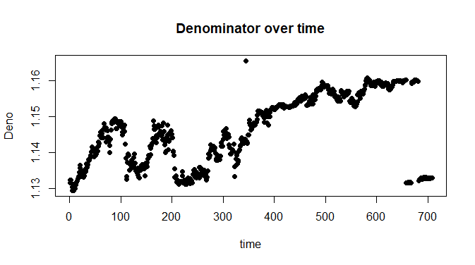

# ETF-of-Dowjones-Index
使用道瓊工業指數2015/3/18~2018/1/5的日指數做出一個ETF

### Error

Sum of error equals to -1.661404e-16
which means the return of this portfolio is almost equal to original DJ index.

### Denominator over time

### Tracking Result

